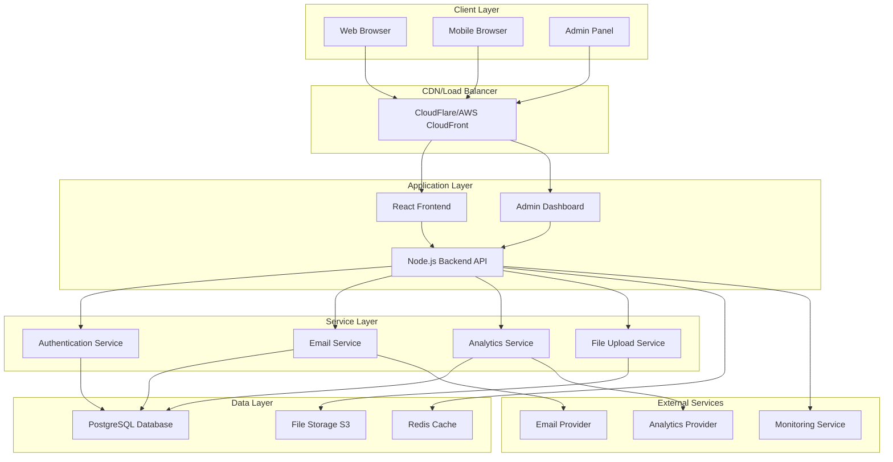

# System Architecture Documentation

## Overview

The Myzuwa Waitlist Platform is designed as a modern, scalable web application with a clear separation between frontend presentation, backend business logic, and data persistence layers. This document outlines the complete system architecture, design patterns, and technical decisions.

## Architecture Principles

### 1. Separation of Concerns
- **Frontend**: User interface and user experience
- **Backend**: Business logic and API services
- **Database**: Data persistence and integrity
- **Cache**: Performance optimization
- **Storage**: File and asset management

### 2. Scalability
- Horizontal scaling capabilities
- Microservices-ready architecture
- Database optimization for growth
- CDN integration for global performance

### 3. Security
- Authentication and authorization
- Data encryption and protection
- Input validation and sanitization
- Rate limiting and abuse prevention

### 4. Maintainability
- Clean code principles
- Comprehensive testing
- Documentation and monitoring
- Version control and CI/CD

## System Overview



## Frontend Architecture

### Technology Stack
- **React 18**: Component-based UI framework
- **TypeScript**: Type safety and developer experience
- **Vite**: Fast build tool and development server
- **Tailwind CSS**: Utility-first CSS framework
- **React Router**: Client-side routing
- **Context API**: State management

### Component Architecture

```
src/
├── components/
│   ├── common/              # Reusable UI components
│   │   ├── Button.tsx
│   │   ├── Input.tsx
│   │   ├── Modal.tsx
│   │   └── LoadingSpinner.tsx
│   ├── forms/               # Form-specific components
│   │   ├── EmailCapture.tsx
│   │   ├── WaitlistForm.tsx
│   │   └── FormField.tsx
│   ├── admin/               # Admin panel components
│   │   ├── Dashboard.tsx
│   │   ├── Sidebar.tsx
│   │   ├── DataTable.tsx
│   │   └── ContentEditor.tsx
│   └── layout/              # Layout components
│       ├── Header.tsx
│       ├── Footer.tsx
│       └── Layout.tsx
├── contexts/                # React contexts
│   ├── ContentContext.tsx
│   ├── SettingsContext.tsx
│   └── AuthContext.tsx
├── hooks/                   # Custom React hooks
│   ├── useApi.ts
│   ├── useDebounce.ts
│   └── useLocalStorage.ts
├── services/                # API service functions
│   ├── api.ts
│   ├── waitlistService.ts
│   └── authService.ts
├── types/                   # TypeScript definitions
│   ├── waitlist.ts
│   ├── content.ts
│   └── settings.ts
└── utils/                   # Utility functions
    ├── validation.ts
    ├── formatting.ts
    └── constants.ts
```

### State Management Strategy

#### Context API Usage
```typescript
// Global state management using React Context
interface AppState {
  user: User | null;
  content: SiteContent;
  settings: SiteSettings;
  waitlistData: WaitlistEntry[];
}

// Context providers wrap the application
<AuthProvider>
  <SettingsProvider>
    <ContentProvider>
      <App />
    </ContentProvider>
  </SettingsProvider>
</AuthProvider>
```

#### Local State Management
- Component-level state for UI interactions
- Form state management with controlled components
- Temporary data and loading states

### Routing Architecture

```typescript
// Route structure
const routes = [
  {
    path: '/',
    element: <WaitlistFlow />,
    children: [
      { index: true, element: <EmailCapture /> },
      { path: 'details', element: <WaitlistForm /> },
      { path: 'success', element: <SuccessMessage /> }
    ]
  },
  {
    path: '/admin',
    element: <AdminLayout />,
    children: [
      { index: true, element: <Navigate to="/admin/dashboard" /> },
      { path: 'dashboard', element: <Dashboard /> },
      { path: 'waitlist', element: <WaitlistManagement /> },
      { path: 'content/*', element: <ContentEditor /> },
      { path: 'settings', element: <SiteSettings /> }
    ]
  }
];
```

## Backend Architecture

### Technology Stack
- **Node.js**: JavaScript runtime
- **Express.js**: Web application framework
- **TypeScript**: Type safety
- **Prisma**: Database ORM
- **JWT**: Authentication tokens
- **bcrypt**: Password hashing
- **Winston**: Logging
- **Bull**: Job queues

### Layered Architecture

```
backend/
├── src/
│   ├── controllers/         # Request handlers
│   │   ├── authController.ts
│   │   ├── waitlistController.ts
│   │   ├── contentController.ts
│   │   └── adminController.ts
│   ├── services/            # Business logic
│   │   ├── authService.ts
│   │   ├── waitlistService.ts
│   │   ├── emailService.ts
│   │   └── analyticsService.ts
│   ├── repositories/        # Data access layer
│   │   ├── userRepository.ts
│   │   ├── waitlistRepository.ts
│   │   └── contentRepository.ts
│   ├── middleware/          # Express middleware
│   │   ├── auth.ts
│   │   ├── validation.ts
│   │   ├── rateLimit.ts
│   │   └── errorHandler.ts
│   ├── routes/              # API routes
│   │   ├── auth.ts
│   │   ├── waitlist.ts
│   │   ├── admin.ts
│   │   └── health.ts
│   ├── models/              # Data models
│   │   ├── User.ts
│   │   ├── WaitlistEntry.ts
│   │   └── SiteContent.ts
│   ├── utils/               # Utility functions
│   │   ├── logger.ts
│   │   ├── validation.ts
│   │   └── encryption.ts
│   └── config/              # Configuration
│       ├── database.ts
│       ├── redis.ts
│       └── email.ts
├── prisma/                  # Database schema
│   ├── schema.prisma
│   ├── migrations/
│   └── seeds/
└── tests/                   # Test files
    ├── unit/
    ├── integration/
    └── e2e/
```

### API Design Patterns

#### RESTful API Structure
```
GET    /api/v1/waitlist           # Get waitlist entries (admin)
POST   /api/v1/waitlist           # Create waitlist entry
GET    /api/v1/waitlist/:id       # Get specific entry (admin)
PUT    /api/v1/waitlist/:id       # Update entry (admin)
DELETE /api/v1/waitlist/:id       # Delete entry (admin)

GET    /api/v1/admin/stats        # Get statistics
GET    /api/v1/admin/export       # Export data
POST   /api/v1/admin/content      # Update content
GET    /api/v1/admin/settings     # Get settings
PUT    /api/v1/admin/settings     # Update settings
```

#### Request/Response Format
```typescript
// Standard API response format
interface ApiResponse<T> {
  success: boolean;
  data?: T;
  error?: {
    code: string;
    message: string;
    details?: any;
  };
  meta?: {
    pagination?: PaginationInfo;
    timestamp: string;
    requestId: string;
  };
}

// Pagination format
interface PaginationInfo {
  page: number;
  limit: number;
  total: number;
  totalPages: number;
  hasNext: boolean;
  hasPrev: boolean;
}
```

### Service Layer Architecture

#### Waitlist Service
```typescript
class WaitlistService {
  constructor(
    private waitlistRepo: WaitlistRepository,
    private emailService: EmailService,
    private analyticsService: AnalyticsService
  ) {}

  async createEntry(data: CreateWaitlistEntryDto): Promise<WaitlistEntry> {
    // Validate input
    await this.validateEntry(data);
    
    // Check for duplicates
    await this.checkDuplicate(data.email);
    
    // Create entry
    const entry = await this.waitlistRepo.create(data);
    
    // Send welcome email
    await this.emailService.sendWelcomeEmail(entry);
    
    // Track analytics
    await this.analyticsService.trackSignup(entry);
    
    return entry;
  }

  async getEntries(filters: WaitlistFilters): Promise<PaginatedResult<WaitlistEntry>> {
    return await this.waitlistRepo.findMany(filters);
  }

  async getStatistics(): Promise<WaitlistStatistics> {
    return await this.waitlistRepo.getStatistics();
  }
}
```

#### Email Service
```typescript
class EmailService {
  constructor(
    private emailProvider: EmailProvider,
    private templateService: TemplateService,
    private queueService: QueueService
  ) {}

  async sendWelcomeEmail(entry: WaitlistEntry): Promise<void> {
    const template = await this.templateService.getTemplate('welcome');
    const emailData = this.templateService.renderTemplate(template, entry);
    
    await this.queueService.addJob('send-email', {
      to: entry.email,
      subject: emailData.subject,
      html: emailData.html,
      text: emailData.text
    });
  }

  async processEmailQueue(): Promise<void> {
    const jobs = await this.queueService.getJobs('send-email', 100);
    
    for (const job of jobs) {
      try {
        await this.emailProvider.send(job.data);
        await job.remove();
      } catch (error) {
        await job.retry();
      }
    }
  }
}
```

## Database Architecture

### Schema Design

#### Core Tables
```sql
-- Users table for admin authentication
CREATE TABLE users (
    id UUID PRIMARY KEY DEFAULT gen_random_uuid(),
    username VARCHAR(50) UNIQUE NOT NULL,
    email VARCHAR(255) UNIQUE NOT NULL,
    password_hash VARCHAR(255) NOT NULL,
    role VARCHAR(20) DEFAULT 'admin',
    is_active BOOLEAN DEFAULT true,
    last_login TIMESTAMPTZ,
    created_at TIMESTAMPTZ DEFAULT NOW(),
    updated_at TIMESTAMPTZ DEFAULT NOW()
);

-- Waitlist entries table
CREATE TABLE waitlist_entries (
    id UUID PRIMARY KEY DEFAULT gen_random_uuid(),
    email VARCHAR(255) UNIQUE NOT NULL,
    full_name VARCHAR(255) NOT NULL,
    phone_number VARCHAR(50) NOT NULL,
    type_of_business VARCHAR(100) NOT NULL,
    custom_business_types TEXT,
    country VARCHAR(100) NOT NULL,
    city VARCHAR(100) NOT NULL,
    has_run_store_before BOOLEAN DEFAULT false,
    wants_tutorial_book BOOLEAN DEFAULT false,
    ip_address INET,
    user_agent TEXT,
    referrer TEXT,
    utm_source VARCHAR(100),
    utm_medium VARCHAR(100),
    utm_campaign VARCHAR(100),
    status VARCHAR(20) DEFAULT 'active',
    email_verified BOOLEAN DEFAULT false,
    email_verification_token VARCHAR(255),
    email_verification_sent_at TIMESTAMPTZ,
    created_at TIMESTAMPTZ DEFAULT NOW(),
    updated_at TIMESTAMPTZ DEFAULT NOW()
);

-- Site content for CMS functionality
CREATE TABLE site_content (
    id UUID PRIMARY KEY DEFAULT gen_random_uuid(),
    key VARCHAR(100) UNIQUE NOT NULL,
    value TEXT NOT NULL,
    type VARCHAR(20) DEFAULT 'text',
    category VARCHAR(50) NOT NULL,
    description TEXT,
    is_active BOOLEAN DEFAULT true,
    created_at TIMESTAMPTZ DEFAULT NOW(),
    updated_at TIMESTAMPTZ DEFAULT NOW(),
    updated_by UUID REFERENCES users(id)
);

-- Site settings
CREATE TABLE site_settings (
    id UUID PRIMARY KEY DEFAULT gen_random_uuid(),
    key VARCHAR(100) UNIQUE NOT NULL,
    value TEXT NOT NULL,
    type VARCHAR(20) DEFAULT 'text',
    category VARCHAR(50) NOT NULL,
    description TEXT,
    is_sensitive BOOLEAN DEFAULT false,
    created_at TIMESTAMPTZ DEFAULT NOW(),
    updated_at TIMESTAMPTZ DEFAULT NOW(),
    updated_by UUID REFERENCES users(id)
);
```

#### Indexing Strategy
```sql
-- Performance indexes
CREATE INDEX idx_waitlist_email ON waitlist_entries(email);
CREATE INDEX idx_waitlist_created_at ON waitlist_entries(created_at DESC);
CREATE INDEX idx_waitlist_country ON waitlist_entries(country);
CREATE INDEX idx_waitlist_business_type ON waitlist_entries(type_of_business);
CREATE INDEX idx_waitlist_status ON waitlist_entries(status);

-- Composite indexes for common queries
CREATE INDEX idx_waitlist_admin_filter ON waitlist_entries(status, email_verified, created_at DESC);
CREATE INDEX idx_waitlist_analytics ON waitlist_entries(country, type_of_business, created_at);

-- Content management indexes
CREATE INDEX idx_content_key ON site_content(key);
CREATE INDEX idx_content_category ON site_content(category);
CREATE INDEX idx_settings_key ON site_settings(key);
CREATE INDEX idx_settings_category ON site_settings(category);
```

### Data Access Patterns

#### Repository Pattern
```typescript
interface WaitlistRepository {
  create(data: CreateWaitlistEntryDto): Promise<WaitlistEntry>;
  findById(id: string): Promise<WaitlistEntry | null>;
  findByEmail(email: string): Promise<WaitlistEntry | null>;
  findMany(filters: WaitlistFilters): Promise<PaginatedResult<WaitlistEntry>>;
  update(id: string, data: UpdateWaitlistEntryDto): Promise<WaitlistEntry>;
  delete(id: string): Promise<void>;
  getStatistics(): Promise<WaitlistStatistics>;
}

class PrismaWaitlistRepository implements WaitlistRepository {
  constructor(private prisma: PrismaClient) {}

  async create(data: CreateWaitlistEntryDto): Promise<WaitlistEntry> {
    return await this.prisma.waitlistEntry.create({
      data: {
        ...data,
        id: undefined // Let database generate UUID
      }
    });
  }

  async findMany(filters: WaitlistFilters): Promise<PaginatedResult<WaitlistEntry>> {
    const { page, limit, search, country, businessType } = filters;
    const skip = (page - 1) * limit;

    const where = this.buildWhereClause(filters);
    
    const [entries, total] = await Promise.all([
      this.prisma.waitlistEntry.findMany({
        where,
        skip,
        take: limit,
        orderBy: { createdAt: 'desc' }
      }),
      this.prisma.waitlistEntry.count({ where })
    ]);

    return {
      data: entries,
      pagination: {
        page,
        limit,
        total,
        totalPages: Math.ceil(total / limit),
        hasNext: page * limit < total,
        hasPrev: page > 1
      }
    };
  }

  private buildWhereClause(filters: WaitlistFilters) {
    const where: any = {};

    if (filters.search) {
      where.OR = [
        { fullName: { contains: filters.search, mode: 'insensitive' } },
        { email: { contains: filters.search, mode: 'insensitive' } }
      ];
    }

    if (filters.country) {
      where.country = filters.country;
    }

    if (filters.businessType) {
      where.typeOfBusiness = filters.businessType;
    }

    return where;
  }
}
```

## Caching Strategy

### Redis Cache Architecture

#### Cache Layers
```typescript
class CacheService {
  constructor(private redis: Redis) {}

  // Application-level caching
  async getWaitlistStats(): Promise<WaitlistStatistics | null> {
    const cached = await this.redis.get('waitlist:stats');
    return cached ? JSON.parse(cached) : null;
  }

  async setWaitlistStats(stats: WaitlistStatistics, ttl: number = 300): Promise<void> {
    await this.redis.setex('waitlist:stats', ttl, JSON.stringify(stats));
  }

  // Session management
  async setSession(sessionId: string, data: SessionData, ttl: number = 86400): Promise<void> {
    await this.redis.setex(`session:${sessionId}`, ttl, JSON.stringify(data));
  }

  async getSession(sessionId: string): Promise<SessionData | null> {
    const cached = await this.redis.get(`session:${sessionId}`);
    return cached ? JSON.parse(cached) : null;
  }

  // Rate limiting
  async checkRateLimit(key: string, limit: number, window: number): Promise<boolean> {
    const current = await this.redis.incr(key);
    if (current === 1) {
      await this.redis.expire(key, window);
    }
    return current <= limit;
  }
}
```

#### Cache Invalidation Strategy
```typescript
class CacheInvalidationService {
  constructor(private cache: CacheService) {}

  async invalidateWaitlistCache(): Promise<void> {
    const patterns = [
      'waitlist:stats',
      'waitlist:entries:*',
      'waitlist:count:*'
    ];

    for (const pattern of patterns) {
      await this.cache.invalidatePattern(pattern);
    }
  }

  async invalidateContentCache(): Promise<void> {
    await this.cache.invalidatePattern('content:*');
  }

  async invalidateSettingsCache(): Promise<void> {
    await this.cache.invalidatePattern('settings:*');
  }
}
```

## Security Architecture

### Authentication & Authorization

#### JWT Token Strategy
```typescript
class AuthService {
  constructor(
    private userRepository: UserRepository,
    private jwtSecret: string
  ) {}

  async login(username: string, password: string): Promise<AuthResult> {
    // Find user
    const user = await this.userRepository.findByUsername(username);
    if (!user) {
      throw new UnauthorizedError('Invalid credentials');
    }

    // Verify password
    const isValid = await bcrypt.compare(password, user.passwordHash);
    if (!isValid) {
      throw new UnauthorizedError('Invalid credentials');
    }

    // Generate JWT token
    const token = jwt.sign(
      { 
        userId: user.id, 
        username: user.username, 
        role: user.role 
      },
      this.jwtSecret,
      { expiresIn: '24h' }
    );

    // Update last login
    await this.userRepository.updateLastLogin(user.id);

    return {
      token,
      user: {
        id: user.id,
        username: user.username,
        email: user.email,
        role: user.role
      }
    };
  }

  async verifyToken(token: string): Promise<TokenPayload> {
    try {
      return jwt.verify(token, this.jwtSecret) as TokenPayload;
    } catch (error) {
      throw new UnauthorizedError('Invalid token');
    }
  }
}
```

#### Middleware Security
```typescript
// Authentication middleware
export const authenticateToken = async (req: AuthRequest, res: Response, next: NextFunction) => {
  const authHeader = req.headers.authorization;
  const token = authHeader?.split(' ')[1];

  if (!token) {
    return res.status(401).json({
      success: false,
      error: { code: 'UNAUTHORIZED', message: 'Access token required' }
    });
  }

  try {
    const payload = await authService.verifyToken(token);
    req.user = payload;
    next();
  } catch (error) {
    return res.status(403).json({
      success: false,
      error: { code: 'FORBIDDEN', message: 'Invalid token' }
    });
  }
};

// Rate limiting middleware
export const rateLimitMiddleware = (windowMs: number, max: number) => {
  return async (req: Request, res: Response, next: NextFunction) => {
    const key = `rate_limit:${req.ip}`;
    const isAllowed = await cacheService.checkRateLimit(key, max, windowMs / 1000);
    
    if (!isAllowed) {
      return res.status(429).json({
        success: false,
        error: { code: 'RATE_LIMITED', message: 'Too many requests' }
      });
    }
    
    next();
  };
};
```

### Input Validation & Sanitization

#### Validation Schema
```typescript
import Joi from 'joi';

export const waitlistEntrySchema = Joi.object({
  email: Joi.string()
    .email()
    .max(255)
    .required()
    .messages({
      'string.email': 'Please enter a valid email address',
      'any.required': 'Email is required'
    }),
  
  fullName: Joi.string()
    .min(2)
    .max(255)
    .pattern(/^[a-zA-Z\s\-'\.]+$/)
    .required()
    .messages({
      'string.min': 'Name must be at least 2 characters',
      'string.pattern.base': 'Name contains invalid characters'
    }),
  
  phoneNumber: Joi.string()
    .pattern(/^[\+]?[\d\s\-\(\)]+$/)
    .min(10)
    .max(20)
    .required(),
  
  typeOfBusiness: Joi.string()
    .valid(...BUSINESS_TYPES)
    .required(),
  
  country: Joi.string()
    .valid(...COUNTRIES)
    .required(),
  
  city: Joi.string()
    .min(2)
    .max(100)
    .pattern(/^[a-zA-Z\s\-'\.]+$/)
    .required()
});

// Validation middleware
export const validateRequest = (schema: Joi.ObjectSchema) => {
  return (req: Request, res: Response, next: NextFunction) => {
    const { error, value } = schema.validate(req.body, { abortEarly: false });
    
    if (error) {
      return res.status(400).json({
        success: false,
        error: {
          code: 'VALIDATION_ERROR',
          message: 'Invalid input data',
          details: error.details.map(detail => ({
            field: detail.path.join('.'),
            message: detail.message
          }))
        }
      });
    }
    
    req.body = value;
    next();
  };
};
```

## Monitoring & Observability

### Application Monitoring

#### Health Checks
```typescript
class HealthCheckService {
  constructor(
    private database: PrismaClient,
    private redis: Redis,
    private emailService: EmailService
  ) {}

  async checkHealth(): Promise<HealthStatus> {
    const checks = await Promise.allSettled([
      this.checkDatabase(),
      this.checkRedis(),
      this.checkEmailService(),
      this.checkDiskSpace(),
      this.checkMemoryUsage()
    ]);

    const results = checks.map((check, index) => ({
      service: ['database', 'redis', 'email', 'disk', 'memory'][index],
      status: check.status === 'fulfilled' ? 'healthy' : 'unhealthy',
      details: check.status === 'fulfilled' ? check.value : check.reason
    }));

    const overallStatus = results.every(r => r.status === 'healthy') ? 'healthy' : 'unhealthy';

    return {
      status: overallStatus,
      timestamp: new Date().toISOString(),
      version: process.env.npm_package_version || '1.0.0',
      uptime: process.uptime(),
      checks: results
    };
  }

  private async checkDatabase(): Promise<any> {
    await this.database.$queryRaw`SELECT 1`;
    return { message: 'Database connection successful' };
  }

  private async checkRedis(): Promise<any> {
    await this.redis.ping();
    return { message: 'Redis connection successful' };
  }

  private async checkEmailService(): Promise<any> {
    // Implement email service health check
    return { message: 'Email service operational' };
  }
}
```

#### Metrics Collection
```typescript
import prometheus from 'prom-client';

// Application metrics
const httpRequestDuration = new prometheus.Histogram({
  name: 'http_request_duration_seconds',
  help: 'Duration of HTTP requests in seconds',
  labelNames: ['method', 'route', 'status_code'],
  buckets: [0.1, 0.3, 0.5, 0.7, 1, 3, 5, 7, 10]
});

const httpRequestTotal = new prometheus.Counter({
  name: 'http_requests_total',
  help: 'Total number of HTTP requests',
  labelNames: ['method', 'route', 'status_code']
});

const waitlistSignupsTotal = new prometheus.Counter({
  name: 'waitlist_signups_total',
  help: 'Total number of waitlist signups',
  labelNames: ['country', 'business_type']
});

const databaseConnectionPool = new prometheus.Gauge({
  name: 'database_connections_active',
  help: 'Number of active database connections'
});

// Metrics middleware
export const metricsMiddleware = (req: Request, res: Response, next: NextFunction) => {
  const start = Date.now();
  
  res.on('finish', () => {
    const duration = (Date.now() - start) / 1000;
    const route = req.route?.path || req.path;
    
    httpRequestDuration
      .labels(req.method, route, res.statusCode.toString())
      .observe(duration);
    
    httpRequestTotal
      .labels(req.method, route, res.statusCode.toString())
      .inc();
  });
  
  next();
};
```

### Logging Strategy

#### Structured Logging
```typescript
import winston from 'winston';

const logger = winston.createLogger({
  level: process.env.LOG_LEVEL || 'info',
  format: winston.format.combine(
    winston.format.timestamp(),
    winston.format.errors({ stack: true }),
    winston.format.json(),
    winston.format.printf(({ timestamp, level, message, ...meta }) => {
      return JSON.stringify({
        timestamp,
        level,
        message,
        service: 'myzuwa-api',
        environment: process.env.NODE_ENV,
        ...meta
      });
    })
  ),
  transports: [
    new winston.transports.File({ 
      filename: 'logs/error.log', 
      level: 'error',
      maxsize: 5242880,
      maxFiles: 5
    }),
    new winston.transports.File({ 
      filename: 'logs/combined.log',
      maxsize: 5242880,
      maxFiles: 5
    })
  ]
});

// Request logging middleware
export const requestLogger = (req: Request, res: Response, next: NextFunction) => {
  const start = Date.now();
  
  res.on('finish', () => {
    const duration = Date.now() - start;
    
    logger.info('HTTP Request', {
      method: req.method,
      url: req.url,
      statusCode: res.statusCode,
      duration,
      userAgent: req.get('User-Agent'),
      ip: req.ip,
      userId: (req as any).user?.userId
    });
  });
  
  next();
};
```

## Performance Optimization

### Database Optimization

#### Query Optimization
```typescript
class OptimizedWaitlistRepository {
  // Use database-level pagination
  async findManyOptimized(filters: WaitlistFilters): Promise<PaginatedResult<WaitlistEntry>> {
    const { page, limit } = filters;
    const offset = (page - 1) * limit;

    // Use raw SQL for complex queries
    const entries = await this.prisma.$queryRaw<WaitlistEntry[]>`
      SELECT 
        id, email, full_name, phone_number, type_of_business,
        country, city, has_run_store_before, wants_tutorial_book,
        created_at, updated_at
      FROM waitlist_entries
      WHERE status = 'active'
        AND ($1::text IS NULL OR country = $1)
        AND ($2::text IS NULL OR type_of_business = $2)
        AND ($3::text IS NULL OR (
          full_name ILIKE $3 OR email ILIKE $3
        ))
      ORDER BY created_at DESC
      LIMIT $4 OFFSET $5
    `;

    // Get count with separate optimized query
    const [{ count }] = await this.prisma.$queryRaw<[{ count: bigint }]>`
      SELECT COUNT(*) as count
      FROM waitlist_entries
      WHERE status = 'active'
        AND ($1::text IS NULL OR country = $1)
        AND ($2::text IS NULL OR type_of_business = $2)
        AND ($3::text IS NULL OR (
          full_name ILIKE $3 OR email ILIKE $3
        ))
    `;

    return {
      data: entries,
      pagination: {
        page,
        limit,
        total: Number(count),
        totalPages: Math.ceil(Number(count) / limit),
        hasNext: page * limit < Number(count),
        hasPrev: page > 1
      }
    };
  }

  // Batch operations for better performance
  async createMany(entries: CreateWaitlistEntryDto[]): Promise<void> {
    await this.prisma.waitlistEntry.createMany({
      data: entries,
      skipDuplicates: true
    });
  }
}
```

#### Connection Pooling
```typescript
// Database configuration
const databaseConfig = {
  datasources: {
    db: {
      url: process.env.DATABASE_URL
    }
  },
  log: process.env.NODE_ENV === 'development' ? ['query', 'info', 'warn'] : ['error'],
  errorFormat: 'pretty'
};

// Connection pool settings
const poolConfig = {
  connectionLimit: parseInt(process.env.DB_CONNECTION_LIMIT || '20'),
  acquireTimeoutMillis: 60000,
  timeout: 60000,
  idleTimeoutMillis: 600000
};
```

### Frontend Optimization

#### Code Splitting
```typescript
// Lazy loading for admin components
const AdminDashboard = lazy(() => import('./components/admin/AdminDashboard'));
const ContentEditor = lazy(() => import('./components/admin/ContentEditor'));
const SiteSettings = lazy(() => import('./components/admin/SiteSettings'));

// Route-based code splitting
const AdminRoutes = () => (
  <Suspense fallback={<LoadingSpinner />}>
    <Routes>
      <Route path="/dashboard" element={<AdminDashboard />} />
      <Route path="/content/*" element={<ContentEditor />} />
      <Route path="/settings" element={<SiteSettings />} />
    </Routes>
  </Suspense>
);
```

#### Asset Optimization
```typescript
// Vite configuration for optimization
export default defineConfig({
  build: {
    rollupOptions: {
      output: {
        manualChunks: {
          vendor: ['react', 'react-dom'],
          router: ['react-router-dom'],
          ui: ['lucide-react'],
          admin: ['./src/components/admin/index.ts']
        }
      }
    },
    chunkSizeWarningLimit: 1000,
    minify: 'terser',
    terserOptions: {
      compress: {
        drop_console: true,
        drop_debugger: true
      }
    }
  },
  optimizeDeps: {
    include: ['react', 'react-dom'],
    exclude: ['lucide-react']
  }
});
```

This architecture documentation provides a comprehensive overview of the Myzuwa Waitlist Platform's technical design, covering all major components and their interactions. The architecture is designed to be scalable, maintainable, and secure while providing excellent performance and user experience.