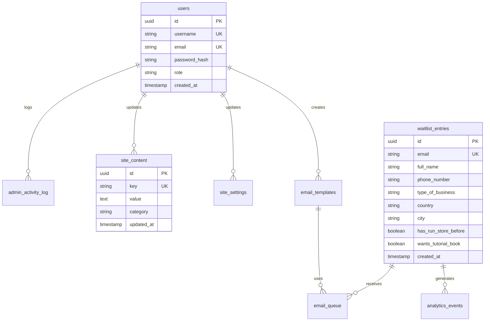

# Database Schema Documentation

## Overview

The Myzuwa waitlist platform uses a relational database design optimized for scalability and data integrity. This document outlines the complete database schema, relationships, and data processing workflows.

## Database Technology

**Primary Recommendation: PostgreSQL**
- ACID compliance for data integrity
- JSON support for flexible content storage
- Excellent performance with proper indexing
- Strong ecosystem and tooling

**Alternative: MongoDB**
- Document-based storage
- Flexible schema evolution
- Good for rapid prototyping

## Core Tables

### 1. Users Table
Stores admin user accounts and authentication data.

```sql
CREATE TABLE users (
    id UUID PRIMARY KEY DEFAULT gen_random_uuid(),
    username VARCHAR(50) UNIQUE NOT NULL,
    email VARCHAR(255) UNIQUE NOT NULL,
    password_hash VARCHAR(255) NOT NULL,
    role VARCHAR(20) DEFAULT 'admin',
    is_active BOOLEAN DEFAULT true,
    last_login TIMESTAMPTZ,
    created_at TIMESTAMPTZ DEFAULT NOW(),
    updated_at TIMESTAMPTZ DEFAULT NOW()
);

-- Indexes
CREATE INDEX idx_users_username ON users(username);
CREATE INDEX idx_users_email ON users(email);
CREATE INDEX idx_users_role ON users(role);
```

### 2. Waitlist Entries Table
Primary table for storing waitlist registrations.

```sql
CREATE TABLE waitlist_entries (
    id UUID PRIMARY KEY DEFAULT gen_random_uuid(),
    email VARCHAR(255) UNIQUE NOT NULL,
    full_name VARCHAR(255) NOT NULL,
    phone_number VARCHAR(50) NOT NULL,
    type_of_business VARCHAR(100) NOT NULL,
    custom_business_types TEXT,
    country VARCHAR(100) NOT NULL,
    city VARCHAR(100) NOT NULL,
    has_run_store_before BOOLEAN DEFAULT false,
    wants_tutorial_book BOOLEAN DEFAULT false,
    ip_address INET,
    user_agent TEXT,
    referrer TEXT,
    utm_source VARCHAR(100),
    utm_medium VARCHAR(100),
    utm_campaign VARCHAR(100),
    status VARCHAR(20) DEFAULT 'active',
    email_verified BOOLEAN DEFAULT false,
    email_verification_token VARCHAR(255),
    email_verification_sent_at TIMESTAMPTZ,
    created_at TIMESTAMPTZ DEFAULT NOW(),
    updated_at TIMESTAMPTZ DEFAULT NOW()
);

-- Indexes
CREATE INDEX idx_waitlist_email ON waitlist_entries(email);
CREATE INDEX idx_waitlist_country ON waitlist_entries(country);
CREATE INDEX idx_waitlist_business_type ON waitlist_entries(type_of_business);
CREATE INDEX idx_waitlist_created_at ON waitlist_entries(created_at);
CREATE INDEX idx_waitlist_status ON waitlist_entries(status);
CREATE INDEX idx_waitlist_utm_source ON waitlist_entries(utm_source);
```

### 3. Site Content Table
Stores all manageable frontend content.

```sql
CREATE TABLE site_content (
    id UUID PRIMARY KEY DEFAULT gen_random_uuid(),
    key VARCHAR(100) UNIQUE NOT NULL,
    value TEXT NOT NULL,
    type VARCHAR(20) DEFAULT 'text', -- text, html, json, url
    category VARCHAR(50) NOT NULL, -- hero, form, success, etc.
    description TEXT,
    is_active BOOLEAN DEFAULT true,
    created_at TIMESTAMPTZ DEFAULT NOW(),
    updated_at TIMESTAMPTZ DEFAULT NOW(),
    updated_by UUID REFERENCES users(id)
);

-- Indexes
CREATE INDEX idx_content_key ON site_content(key);
CREATE INDEX idx_content_category ON site_content(category);
CREATE INDEX idx_content_active ON site_content(is_active);
```

### 4. Site Settings Table
Stores all configurable site settings.

```sql
CREATE TABLE site_settings (
    id UUID PRIMARY KEY DEFAULT gen_random_uuid(),
    key VARCHAR(100) UNIQUE NOT NULL,
    value TEXT NOT NULL,
    type VARCHAR(20) DEFAULT 'text', -- text, number, boolean, json
    category VARCHAR(50) NOT NULL, -- general, seo, email, etc.
    description TEXT,
    is_sensitive BOOLEAN DEFAULT false, -- for API keys, passwords
    created_at TIMESTAMPTZ DEFAULT NOW(),
    updated_at TIMESTAMPTZ DEFAULT NOW(),
    updated_by UUID REFERENCES users(id)
);

-- Indexes
CREATE INDEX idx_settings_key ON site_settings(key);
CREATE INDEX idx_settings_category ON site_settings(category);
```

### 5. Email Templates Table
Stores email templates for automated communications.

```sql
CREATE TABLE email_templates (
    id UUID PRIMARY KEY DEFAULT gen_random_uuid(),
    name VARCHAR(100) UNIQUE NOT NULL,
    subject VARCHAR(255) NOT NULL,
    html_content TEXT NOT NULL,
    text_content TEXT,
    variables JSONB, -- Available template variables
    is_active BOOLEAN DEFAULT true,
    created_at TIMESTAMPTZ DEFAULT NOW(),
    updated_at TIMESTAMPTZ DEFAULT NOW(),
    updated_by UUID REFERENCES users(id)
);

-- Indexes
CREATE INDEX idx_email_templates_name ON email_templates(name);
CREATE INDEX idx_email_templates_active ON email_templates(is_active);
```

### 6. Email Queue Table
Manages outgoing email queue and delivery status.

```sql
CREATE TABLE email_queue (
    id UUID PRIMARY KEY DEFAULT gen_random_uuid(),
    to_email VARCHAR(255) NOT NULL,
    from_email VARCHAR(255) NOT NULL,
    subject VARCHAR(255) NOT NULL,
    html_content TEXT NOT NULL,
    text_content TEXT,
    template_id UUID REFERENCES email_templates(id),
    waitlist_entry_id UUID REFERENCES waitlist_entries(id),
    status VARCHAR(20) DEFAULT 'pending', -- pending, sent, failed, cancelled
    attempts INTEGER DEFAULT 0,
    max_attempts INTEGER DEFAULT 3,
    scheduled_at TIMESTAMPTZ DEFAULT NOW(),
    sent_at TIMESTAMPTZ,
    error_message TEXT,
    created_at TIMESTAMPTZ DEFAULT NOW(),
    updated_at TIMESTAMPTZ DEFAULT NOW()
);

-- Indexes
CREATE INDEX idx_email_queue_status ON email_queue(status);
CREATE INDEX idx_email_queue_scheduled ON email_queue(scheduled_at);
CREATE INDEX idx_email_queue_to_email ON email_queue(to_email);
```

### 7. Analytics Events Table
Tracks user interactions and system events.

```sql
CREATE TABLE analytics_events (
    id UUID PRIMARY KEY DEFAULT gen_random_uuid(),
    event_type VARCHAR(50) NOT NULL, -- page_view, form_submit, email_open, etc.
    event_data JSONB,
    user_id VARCHAR(255), -- Anonymous user ID or session ID
    waitlist_entry_id UUID REFERENCES waitlist_entries(id),
    ip_address INET,
    user_agent TEXT,
    referrer TEXT,
    page_url TEXT,
    utm_source VARCHAR(100),
    utm_medium VARCHAR(100),
    utm_campaign VARCHAR(100),
    created_at TIMESTAMPTZ DEFAULT NOW()
);

-- Indexes
CREATE INDEX idx_analytics_event_type ON analytics_events(event_type);
CREATE INDEX idx_analytics_created_at ON analytics_events(created_at);
CREATE INDEX idx_analytics_user_id ON analytics_events(user_id);
CREATE INDEX idx_analytics_utm_source ON analytics_events(utm_source);
```

### 8. Admin Activity Log Table
Tracks admin actions for audit purposes.

```sql
CREATE TABLE admin_activity_log (
    id UUID PRIMARY KEY DEFAULT gen_random_uuid(),
    user_id UUID REFERENCES users(id),
    action VARCHAR(100) NOT NULL, -- login, logout, update_content, export_data, etc.
    resource_type VARCHAR(50), -- waitlist_entry, site_content, site_settings
    resource_id UUID,
    old_values JSONB,
    new_values JSONB,
    ip_address INET,
    user_agent TEXT,
    created_at TIMESTAMPTZ DEFAULT NOW()
);

-- Indexes
CREATE INDEX idx_admin_log_user_id ON admin_activity_log(user_id);
CREATE INDEX idx_admin_log_action ON admin_activity_log(action);
CREATE INDEX idx_admin_log_created_at ON admin_activity_log(created_at);
```

## Data Relationships



## Data Processing Workflows

### 1. Waitlist Registration Flow

```sql
-- 1. Insert new waitlist entry
INSERT INTO waitlist_entries (
    email, full_name, phone_number, type_of_business,
    country, city, has_run_store_before, wants_tutorial_book,
    ip_address, user_agent, referrer
) VALUES ($1, $2, $3, $4, $5, $6, $7, $8, $9, $10, $11)
RETURNING id;

-- 2. Log analytics event
INSERT INTO analytics_events (
    event_type, event_data, waitlist_entry_id, ip_address, user_agent
) VALUES ('waitlist_signup', $1, $2, $3, $4);

-- 3. Queue welcome email
INSERT INTO email_queue (
    to_email, from_email, subject, html_content,
    template_id, waitlist_entry_id
) VALUES ($1, $2, $3, $4, $5, $6);
```

### 2. Email Processing Workflow

```sql
-- Get pending emails
SELECT * FROM email_queue 
WHERE status = 'pending' 
  AND scheduled_at <= NOW()
  AND attempts < max_attempts
ORDER BY scheduled_at ASC
LIMIT 100;

-- Update email status after sending
UPDATE email_queue 
SET status = 'sent', sent_at = NOW(), attempts = attempts + 1
WHERE id = $1;

-- Handle failed emails
UPDATE email_queue 
SET status = 'failed', error_message = $2, attempts = attempts + 1
WHERE id = $1;
```

### 3. Analytics Aggregation

```sql
-- Daily signup statistics
SELECT 
    DATE(created_at) as date,
    COUNT(*) as signups,
    COUNT(DISTINCT country) as countries,
    COUNT(CASE WHEN has_run_store_before THEN 1 END) as experienced_users
FROM waitlist_entries 
WHERE created_at >= NOW() - INTERVAL '30 days'
GROUP BY DATE(created_at)
ORDER BY date DESC;

-- Business type distribution
SELECT 
    type_of_business,
    COUNT(*) as count,
    ROUND(COUNT(*) * 100.0 / SUM(COUNT(*)) OVER(), 2) as percentage
FROM waitlist_entries 
GROUP BY type_of_business
ORDER BY count DESC;
```

## Performance Optimization

### Indexing Strategy
- Primary keys: UUID with B-tree indexes
- Foreign keys: Automatic indexes
- Query-specific indexes on frequently filtered columns
- Composite indexes for complex queries

### Partitioning (for large datasets)
```sql
-- Partition analytics_events by month
CREATE TABLE analytics_events_y2024m01 PARTITION OF analytics_events
FOR VALUES FROM ('2024-01-01') TO ('2024-02-01');
```

### Caching Strategy
- Redis for session storage
- Application-level caching for site content and settings
- Database query result caching for analytics

## Data Backup and Recovery

### Backup Strategy
```bash
# Daily full backup
pg_dump -h localhost -U postgres -d myzuwa_db > backup_$(date +%Y%m%d).sql

# Continuous WAL archiving for point-in-time recovery
```

### Data Retention Policy
- Waitlist entries: Permanent (with GDPR compliance)
- Analytics events: 2 years
- Email queue: 90 days (successful sends), 30 days (failed)
- Admin activity logs: 1 year

## Security Considerations

### Data Protection
- Encrypt sensitive fields (PII) at rest
- Use parameterized queries to prevent SQL injection
- Implement row-level security for multi-tenant scenarios
- Regular security audits and penetration testing

### GDPR Compliance
```sql
-- Data export for GDPR requests
SELECT * FROM waitlist_entries WHERE email = $1;

-- Data deletion for GDPR requests
UPDATE waitlist_entries 
SET status = 'deleted', 
    email = 'deleted_' || id,
    full_name = 'DELETED',
    phone_number = 'DELETED'
WHERE email = $1;
```

## Monitoring and Alerting

### Key Metrics to Monitor
- Database connection pool usage
- Query performance and slow queries
- Table sizes and growth rates
- Failed email delivery rates
- Signup conversion rates

### Alerting Thresholds
- Database CPU > 80%
- Connection pool > 90% utilized
- Failed email rate > 5%
- Disk space < 20% free

## Migration Strategy

### Schema Migrations
```sql
-- Example migration: Add new column
ALTER TABLE waitlist_entries 
ADD COLUMN marketing_consent BOOLEAN DEFAULT false;

-- Update existing records
UPDATE waitlist_entries 
SET marketing_consent = true 
WHERE created_at >= '2024-01-01';
```

### Data Migration Tools
- Flyway or Liquibase for version control
- Custom migration scripts for data transformations
- Blue-green deployment for zero-downtime updates